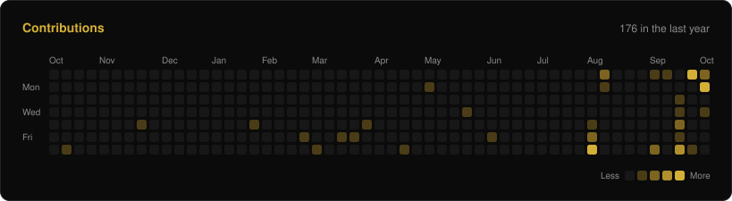

<div align="center">


# Dushyant Prajapati

**AI/ML and full-stack developer**<br />
B.Tech CSE (AI/ML &amp; Data Science) at Sharda University. Tech Lead at Technova.

<a href="https://craftbydushyant.com"> craftbydushyant.com</a>&nbsp;&nbsp;&nbsp;&nbsp;
<a href="https://www.linkedin.com/in/dushyant-prajapati/"> LinkedIn</a>&nbsp;&nbsp;&nbsp;&nbsp;
<a href="https://www.technovashardauniversity.in/"> Technova</a>

<br />


</div>

##  About

I build complete systems: the ML model, the backend API, the database and the frontend. Most of my projects combine applied machine learning with full-stack engineering. They include a dyslexia screening platform, a cardiovascular risk model, an orbital collision tracker, a payment router for AI agents and a production e-commerce store.

At Technova I lead the technical side of the society. I look after the official website and the platforms we use for events and registrations, and I work with the technical and PR teams on our initiatives.

Right now I am spending most of my time on fundamentals: DSA, the math behind ML, deep learning, computer vision, databases, system design and security.

##  What I build

| Area | What it looks like | Projects |
| :-- | :-- | :-- |
|  **Applied ML** | Explainable models (RandomForest with SHAP), synthetic data built from published research, Monte Carlo simulation, PPO reinforcement learning | [Mentis](https://github.com/Dushyant-web/Mentis), [VitaPulse](https://github.com/Dushyant-web/VitaPulse), [Vyoma](https://github.com/Dushyant-web/Vyoma) |
|  **Computer vision** | Eye tracking in the browser with MediaPipe FaceMesh, handwriting OCR with OpenCV and EasyOCR | [Mentis](https://github.com/Dushyant-web/Mentis) |
|  **LLM and retrieval** | BM25 plus vector search with cross-encoder reranking and checks against made-up results, MCP tools, agents with spending limits | [bis-rag](https://github.com/Dushyant-web/bis-rag), [AXIS](https://github.com/Dushyant-web/ASIX) |
|  **Backend** | FastAPI and Node services with PostgreSQL, Redis, JWT and OAuth, rate limiting, WebSockets, scheduled jobs and task queues | [Vyoma](https://github.com/Dushyant-web/Vyoma), [Spend-⁠Wise](https://github.com/Dushyant-web/Spend-Wise) |
|  **Full-stack** | React and Next.js products from database schema to deployment, including payments and shipping | [GAURK](https://github.com/Dushyant-web/Clara), [Mentis](https://github.com/Dushyant-web/Mentis) |
|  **Security and payments** | Idempotent payment flows, replay protection, spending policies, CSP and rate limits, Razorpay and Algorand | [AXIS](https://github.com/Dushyant-web/ASIX), [GAURK](https://github.com/Dushyant-web/Clara) |

##  Featured projects

<table>
<tr>
<td width="50%" valign="top">

###  MENTIS

**Dyslexia and dysgraphia screening using a webcam and a stylus.**

[ **Live: mentis-sih.netlify.app**](https://mentis-sih.netlify.app)

A child reads a passage while the browser tracks their eye movements, then writes on a tablet while every pen stroke is recorded. 23 features based on clinical research feed an explainable RandomForest, which returns a risk profile and a daily practice plan. It is meant for screening, not diagnosis.

<sub>78% accuracy on noisy synthetic data. An early version showed 99% because of a label leak, which was found and removed.</sub>

`Next.js` `FastAPI` `PostgreSQL` `Redis` `scikit-⁠learn` `SHAP` `MediaPipe` `OpenCV`

[ Repository](https://github.com/Dushyant-web/Mentis)&nbsp;&nbsp;&nbsp;[ Docs](https://github.com/Dushyant-web/Mentis/tree/main/docs)

</td>
<td width="50%" valign="top">

###  AXIS

**Atomic x402 payments for AI agents on Algorand.**

An agent describes a workflow and AXIS handles the payments. It reads each provider's price from its 402 response, checks the total against a spending policy, then pays every provider in one Algorand atomic group with a single signature. A provider that fails after payment is refunded on-chain, and each run ends with one combined receipt.

<sub>Nine paid services on Cloudflare Workers (Algorand testnet), an npm SDK, an MCP server and a Chrome extension for live monitoring. Built for HackNite Code Royale 2026.</sub>

`TypeScript` `Node.js` `Hono` `Cloudflare Workers` `Next.js` `PostgreSQL` `Algorand`

[ Repository](https://github.com/Dushyant-web/ASIX)&nbsp;&nbsp;&nbsp;[ axis-pay on npm](https://www.npmjs.com/package/axis-pay)

</td>
</tr>
</table>

<table>
<tr>
<td width="50%" valign="top">

###  VYOMA

**Space situational awareness: orbit tracking, collision risk and avoidance.**

Pulls TLE data from CelesTrak and propagates orbits with SGP4. Collision probability comes from Monte Carlo sampling with 95% confidence intervals, and close approaches generate conjunction data messages. A PPO agent trained in a custom Gymnasium environment suggests avoidance maneuvers. The dashboard shows a Three.js globe and live alerts over WebSockets.

`FastAPI` `PostgreSQL` `SQLAlchemy` `SGP4` `stable-⁠baselines3` `Three.js` `WebSockets`

[ Repository](https://github.com/Dushyant-web/Vyoma)

</td>
<td width="50%" valign="top">

###  VITAPULSE

**Cardiovascular risk prediction with explanations.**

A RandomForest trained on vitals and symptoms returns a risk score along with the features that drove it, rule-based clinical notes and what-if scenarios, such as the effect of quitting smoking or lowering blood pressure. Doctors get patient timelines and PDF reports. Hospitals get access through an admin approval flow with audit logs.

`Python` `Flask` `scikit-⁠learn` `pandas` `Firebase Auth` `Firestore` `ReportLab`

[ Repository](https://github.com/Dushyant-web/VitaPulse)

</td>
</tr>
</table>

<table>
<tr>
<td width="50%" valign="top">

###  GAURK

**Production e-commerce platform for a streetwear brand.**

Covers the full order flow: product variants, stock held for 10 minutes during checkout, Razorpay and cash on delivery, Shiprocket shipping, invoices, reviews with photos and an admin dashboard with analytics. The owner also gets a private AI assistant that answers business questions by querying the database, and asks for confirmation before any destructive change.

`React` `Vite` `Tailwind CSS` `FastAPI` `PostgreSQL` `Firebase Auth` `Razorpay`

[ Repository](https://github.com/Dushyant-web/Clara)&nbsp;&nbsp;&nbsp;<sub>291 commits</sub>

</td>
<td width="50%" valign="top">

###  BIS-RAG

**Finds the Indian Standards that apply to a product.**

Searches a 929-page BIS handbook with BM25 and vector retrieval together, then reranks the results with a cross-encoder. Every returned code is checked against the 777 valid IS codes, so the system cannot invent a standard. It runs on CPU and answers in under a second.

<sub>Public 10-query test set: Hit@3 100%, MRR@5 0.90. Built for the BIS × SS Hackathon 2026.</sub>

`Python` `FastAPI` `ChromaDB` `rank-⁠bm25` `sentence-⁠transformers` `React`

[ Repository](https://github.com/Dushyant-web/bis-rag)

</td>
</tr>
</table>

<details>
<summary><b>More projects and contributions</b></summary>

<br />

| Project | What it is | Stack |
| :-- | :-- | :-- |
| [Spend-⁠Wise](https://github.com/Dushyant-web/Spend-Wise) | Expense tracker and AI budget coach. Built to practise shipping end to end: web plus Android and iOS builds with Capacitor, an async API, Redis rate limiting, Celery jobs, Docker Compose and CI/CD. | Next.js, Capacitor, FastAPI, PostgreSQL, Redis, Celery, Docker, GitHub Actions |
| [Velos](https://github.com/Dushyant-web/Velos) | Fleet health platform that turns vehicle telemetry into health scores, failure probability estimates and alerts. Includes a telemetry simulator. | FastAPI, PostgreSQL, JWT, Chart.js, Leaflet |
| [InternPilot](https://github.com/somu0571/InternPilot) (team project) | [19 merged pull requests](https://github.com/somu0571/InternPilot/pulls?q=is%3Apr+author%3ADushyant-web+is%3Amerged): persistent sessions and device management, PWA support, in-app messaging, grievance handling, skill-gap analysis, a recruiter dashboard, and a move of the chatbot to NVIDIA NIM with guardrails. | Node.js, Express, MongoDB, EJS |
| [SHE-CAN](https://github.com/Dushyant-web/SHE-CAN) | Secure contact platform built for an internship task: JWT in httpOnly cookies, bcrypt, Helmet CSP, rate limits per route and an admin panel with CSV export. | Express, SQLite |

</details>

##  Tech stack

<table>
<tr>
<td><b>Languages</b></td>
<td><br /><sub>Also SQL</sub></td>
</tr>
<tr>
<td><b>ML and AI</b></td>
<td><br /><sub>Also NumPy, pandas, SHAP, MediaPipe, EasyOCR, stable-baselines3, Gymnasium, ChromaDB, sentence-transformers, MCP</sub></td>
</tr>
<tr>
<td><b>Backend</b></td>
<td><br /><sub>Also Hono, SQLAlchemy, Alembic, Pydantic, Celery, WebSockets, Razorpay, Algorand (x402)</sub></td>
</tr>
<tr>
<td><b>Frontend</b></td>
<td><br /><sub>Also Framer Motion, Recharts, Capacitor</sub></td>
</tr>
<tr>
<td><b>Data</b></td>
<td><br /><sub>Also Firestore, ChromaDB</sub></td>
</tr>
<tr>
<td><b>Infra and tooling</b></td>
<td><br /><sub>Also Render, Railway</sub></td>
</tr>
</table>

##  Engineering focus

```text
$ cat focus.txt
dsa               patterns, complexity, clean implementations
ml foundations    linear algebra, probability, optimisation
deep learning     how networks actually learn
computer vision   CNNs, detection, tracking
backend           concurrency, caching, queues, observability
databases         indexing, transactions, query planning, storage
system design     scaling, consistency, failure modes
security          authn and authz, OWASP Top 10, threat modelling
open source       reading real codebases, contributing upstream
```

##  Leadership

**Tech Lead, [Technova](https://www.technovashardauniversity.in/)**<br />
The technical society of SCSSE, Sharda University

- Manage the society's technical operations and digital ecosystem
- Build and maintain the official website, [technovashardauniversity.in](https://www.technovashardauniversity.in/)
- Build platforms for events, clubs, registrations and student activities
- Run technical projects from planning and architecture through development, deployment and maintenance
- Work directly with the technical and PR teams, and coordinate students and teams for technical initiatives and events

##  Achievements

&nbsp; **1st rank** in an internal Smart India Hackathon 2026 problem statement<br />
&nbsp; **3rd rank** in another internal Smart India Hackathon 2026 problem statement<br />
&nbsp; Built **AXIS** for HackNite Code Royale 2026 (x402 and Algorand track) and **bis-rag** for the BIS × SS Hackathon 2026 (RAG track)<br />
&nbsp; Published [`axis-pay`](https://www.npmjs.com/package/axis-pay) on npm<br />
&nbsp; 19 merged pull requests to [InternPilot](https://github.com/somu0571/InternPilot), a team project

##  GitHub activity

<p align="center">
  
  
</p>

<p align="center">
  
</p>

<p align="center">
  
</p>

##  Currently exploring

```text
$ cat plan.txt
[now]   open source       learning large codebases, then contributing upstream
[now]   deeper AI/ML      from using models to understanding and training them
[now]   backend/systems   performance, reliability, data-intensive design
[goal]  GSoC 2027         choose an org early and contribute well before proposals
[goal]  a real product    built for real users; YC 2027 only if it gets real traction
```

##  Connect

<p align="center">
  <a href="https://craftbydushyant.com"> Portfolio</a>&nbsp;&nbsp;&nbsp;&nbsp;
  <a href="https://www.linkedin.com/in/dushyant-prajapati/"> LinkedIn</a>&nbsp;&nbsp;&nbsp;&nbsp;
  <a href="https://www.technovashardauniversity.in/"> Technova</a>
</p>

<p align="center"><sub>Open to conversations about AI/ML, backend engineering and open source.</sub></p>
