<div align="center">


# Dushyant Prajapati

**Building AI/ML systems and the full-stack products around them.**

<sub>B.Tech CSE (AI/ML &amp; Data Science), Sharda University · Tech Lead, Technova</sub>

<br />

<a href="https://craftbydushyant.com"></a>
<a href="https://www.linkedin.com/in/dushyant-prajapati/"></a>
<a href="https://www.technovashardauniversity.in/"></a>

<br />
<br />



</div>

## 🧑‍💻 About

I like building end to end — the model, the API around it, the database under it and the interface on top. Most of my work sits where applied ML meets product engineering: a dyslexia screening platform, a cardiovascular risk model, an orbital-collision tracker, a payments router for AI agents and a production storefront.

At **Technova**, the technical society of SCSSE at Sharda University, I lead the technical side: the society's website, its event and registration platforms, and the projects behind them.

Shipping fast got me here. Now I'm deliberately going deeper into fundamentals — DSA, the math behind ML, deep learning, computer vision, databases, system design and security.

## 🧩 What I build

| Area | What that looks like in my work | Seen in |
| :-- | :-- | :-- |
| 🧠 **Applied ML** | Explainable tabular models (RandomForest + SHAP), literature-calibrated synthetic data, Monte Carlo simulation, PPO reinforcement learning | [Mentis](https://github.com/Dushyant-web/Mentis) · [VitaPulse](https://github.com/Dushyant-web/VitaPulse) · [Vyoma](https://github.com/Dushyant-web/Vyoma) |
| 👁️ **Computer vision** | In-browser eye tracking with MediaPipe FaceMesh; an OpenCV + EasyOCR handwriting pipeline | [Mentis](https://github.com/Dushyant-web/Mentis) |
| 🔎 **LLM & retrieval** | Hybrid BM25 + vector search with cross-encoder reranking and hallucination guards; MCP tools and budget-capped agents | [bis-rag](https://github.com/Dushyant-web/bis-rag) · [AXIS](https://github.com/Dushyant-web/ASIX) |
| ⚙️ **Backend** | FastAPI and Node services — PostgreSQL, Redis, JWT/OAuth, rate limiting, WebSockets, schedulers, task queues | [Vyoma](https://github.com/Dushyant-web/Vyoma) · [Spend-⁠Wise](https://github.com/Dushyant-web/Spend-Wise) |
| 🖥️ **Full-stack** | React / Next.js products from schema to deployment, including payments and fulfilment | [GAURK](https://github.com/Dushyant-web/Clara) · [Mentis](https://github.com/Dushyant-web/Mentis) |
| 🔐 **Security & payments** | Idempotency keys, replay protection, spend-policy gates, CSP and rate limits; Razorpay and Algorand settlement | [AXIS](https://github.com/Dushyant-web/ASIX) · [GAURK](https://github.com/Dushyant-web/Clara) |

## 🚀 Featured projects

<sub><code>~/projects</code> — chosen for depth, not count</sub>

<table>
<tr>
<td width="50%" valign="top">

### 🧠 MENTIS

<sub>ASSISTIVE TECH · COMPUTER VISION · ML</sub>

**Dyslexia and dysgraphia screening from a webcam and a stylus.**

A child reads while in-browser eye tracking measures fixations and regressions, then writes while every pen stroke is captured. 23 features grounded in clinical literature feed an explainable RandomForest that returns a risk profile and a daily practice plan — a screening aid, not a diagnosis.

<sub>Caught a label leak that had inflated accuracy to 99%; the honest figure on noisy synthetic data is 78%.</sub>

`Next.js` `FastAPI` `PostgreSQL` `Redis` `scikit-⁠learn` `SHAP` `MediaPipe` `OpenCV`

**[Live demo](https://mentis-sih.netlify.app)** · [Repo](https://github.com/Dushyant-web/Mentis) · [Docs](https://github.com/Dushyant-web/Mentis/tree/main/docs)

</td>
<td width="50%" valign="top">

### ⛓️ AXIS

<sub>AGENT PAYMENTS · WEB3 · SECURITY</sub>

**One signature, many paid APIs — atomic x402 payments for AI agents.**

An agent describes a workflow; AXIS prices each provider from its own `402` challenge, checks a spend policy, then settles every provider in one Algorand atomic group. Results come back with a unified receipt, and a provider that fails after payment is refunded on-chain.

<sub>9 paid services on Cloudflare Workers (Algorand testnet) · npm SDK · MCP server · Chrome live monitor</sub>

`TypeScript` `Node.js` `Hono` `Cloudflare Workers` `Next.js` `PostgreSQL` `Algorand`

[Repo](https://github.com/Dushyant-web/ASIX) · [npm: axis-pay](https://www.npmjs.com/package/axis-pay) · <sub>built for HackNite Code Royale 2026</sub>

</td>
</tr>
</table>

<table>
<tr>
<td width="50%" valign="top">

### 🛰️ VYOMA

<sub>SPACE SITUATIONAL AWARENESS · SIMULATION · RL</sub>

**Orbital tracking, conjunction risk and collision avoidance.**

Ingests CelesTrak TLEs, propagates orbits with SGP4, estimates collision probability by Monte Carlo sampling with 95% confidence intervals, and issues conjunction data messages. A PPO agent trained in a custom Gymnasium environment proposes avoidance burns; a Three.js globe and WebSocket alerts tie it together.

`FastAPI` `PostgreSQL` `SQLAlchemy` `SGP4` `stable-⁠baselines3` `Three.js` `WebSockets`

[Repo](https://github.com/Dushyant-web/Vyoma)

</td>
<td width="50%" valign="top">

### 🩺 VITAPULSE

<sub>HEALTHCARE · EXPLAINABLE ML</sub>

**Cardiovascular risk prediction with explanations a clinician can read.**

A RandomForest over vitals and symptoms returns a risk score with feature-level and rule-based explanations, plus what-if scenarios such as quitting smoking or controlling blood pressure. Patient timelines, PDF reports and an admin-approved hospital access flow with audit logs run on Firebase.

`Python` `Flask` `scikit-⁠learn` `pandas` `Firebase Auth` `Firestore` `ReportLab`

[Repo](https://github.com/Dushyant-web/VitaPulse)

</td>
</tr>
</table>

<table>
<tr>
<td width="50%" valign="top">

### 🛍️ GAURK

<sub>E-COMMERCE · PRODUCTION</sub>

**Production e-commerce platform for a streetwear label.**

The full purchase lifecycle: variant catalogue, time-boxed inventory reservations, Razorpay and cash-on-delivery checkout, Shiprocket fulfilment, invoices, reviews with media and an analytics admin. An owner-only AI assistant answers questions over the database through SQL tool calls and asks before anything destructive.

`React` `Vite` `Tailwind CSS` `FastAPI` `PostgreSQL` `Firebase Auth` `Razorpay`

[Repo](https://github.com/Dushyant-web/Clara) · <sub>291 commits</sub>

</td>
<td width="50%" valign="top">

### 📚 BIS-RAG

<sub>RETRIEVAL · LLM SYSTEMS</sub>

**Finds the Indian Standards that apply to a product, in under a second.**

Hybrid BM25 + vector retrieval over a 929-page BIS handbook, cross-encoder reranking, and a whitelist of all 777 valid IS codes, so the system cannot return a standard that doesn't exist. Runs on CPU and ships with an evaluation dashboard.

<sub>Public 10-query set: Hit@3 100% · MRR@5 0.90 · ~0.8 s average latency</sub>

`Python` `FastAPI` `ChromaDB` `rank-⁠bm25` `sentence-⁠transformers` `React`

[Repo](https://github.com/Dushyant-web/bis-rag) · <sub>built for BIS × SS Hackathon 2026</sub>

</td>
</tr>
</table>

<details>
<summary><b>More projects and contributions</b></summary>

<br />

| Project | What it is | Stack |
| :-- | :-- | :-- |
| [Spend-⁠Wise](https://github.com/Dushyant-web/Spend-Wise) | Expense tracker and AI budget coach, built as an end-to-end shipping exercise: web plus Android/iOS builds via Capacitor, async API, Redis rate limiting, Celery jobs, Docker Compose and a CI/CD pipeline | Next.js · Capacitor · FastAPI · PostgreSQL · Redis · Celery · Docker · GitHub Actions |
| [Velos](https://github.com/Dushyant-web/Velos) | Fleet health and risk platform: vehicle telemetry turned into health scores, failure-probability estimates and alerts, with a telemetry simulator | FastAPI · PostgreSQL · JWT · Chart.js · Leaflet |
| [InternPilot](https://github.com/somu0571/InternPilot) <sub>team project</sub> | [19 merged pull requests](https://github.com/somu0571/InternPilot/pulls?q=is%3Apr+author%3ADushyant-web+is%3Amerged): persistent and manageable sessions, PWA support, in-app messaging, grievance redressal, skill-gap analysis, a recruiter dashboard, and a chatbot migration to NVIDIA NIM with guardrails | Node.js · Express · MongoDB · EJS |
| [SHE-CAN](https://github.com/Dushyant-web/SHE-CAN) | Secure contact platform for an internship task: JWT in httpOnly cookies, bcrypt, Helmet CSP, per-route rate limits and an admin panel with CSV export | Express · SQLite |

</details>

## 🧰 Tech stack

<table>
<tr>
<td><b>Languages</b></td>
<td><br /><sub>+ SQL</sub></td>
</tr>
<tr>
<td><b>ML &amp; AI</b></td>
<td><br /><sub>+ NumPy · pandas · SHAP · MediaPipe · EasyOCR · stable-baselines3 · Gymnasium · ChromaDB · sentence-transformers · MCP</sub></td>
</tr>
<tr>
<td><b>Backend</b></td>
<td><br /><sub>+ Hono · SQLAlchemy · Alembic · Pydantic · Celery · WebSockets · Razorpay · Algorand (x402)</sub></td>
</tr>
<tr>
<td><b>Frontend</b></td>
<td><br /><sub>+ Framer Motion · Recharts · Capacitor</sub></td>
</tr>
<tr>
<td><b>Data</b></td>
<td><br /><sub>+ Firestore · ChromaDB</sub></td>
</tr>
<tr>
<td><b>Infra &amp; tooling</b></td>
<td><br /><sub>+ Render · Railway</sub></td>
</tr>
</table>

## 🎯 Engineering focus

```text
$ cat ~/focus.txt
# from "it works" to "I know why it works"

  dsa               patterns, complexity, clean implementations
  ml foundations    linear algebra, probability, optimisation
  deep learning     how networks actually learn
  computer vision   CNNs, detection, tracking
  backend           concurrency, caching, queues, observability
  databases         indexing, transactions, query planning, storage
  system design     scaling, consistency, failure modes
  security          authn/authz, OWASP Top 10, threat modelling
  open source       reading real codebases, contributing upstream
```

## 🏛️ Leadership

**Tech Lead — [Technova](https://www.technovashardauniversity.in/)**, the technical society of SCSSE, Sharda University

- Own the society's technical operations and digital ecosystem
- Build and maintain the official website, [technovashardauniversity.in](https://www.technovashardauniversity.in/)
- Build platforms for events, clubs, registrations and student activities
- Run technical projects end to end — planning, architecture, development, deployment and maintenance
- Work directly with the technical and PR teams, and coordinate students and teams across technical initiatives and events

## 🏆 Achievements

- 🥇 **1st rank** — Internal Smart India Hackathon 2026, on one problem statement
- 🥉 **3rd rank** — Internal Smart India Hackathon 2026, on a second problem statement
- 🛠️ Built **AXIS** for HackNite Code Royale 2026 (x402 &amp; Algorand track) and **bis-rag** for the BIS × SS Hackathon 2026 (RAG track)
- 📦 Published [`axis-pay`](https://www.npmjs.com/package/axis-pay) on npm
- 🔀 19 merged pull requests to [InternPilot](https://github.com/somu0571/InternPilot), a team project

## 📊 GitHub activity

<p align="center">
  
  
</p>

<p align="center">
  
</p>

<p align="center">
  <picture>
    <source media="(prefers-color-scheme: dark)" srcset="https://raw.githubusercontent.com/Dushyant-web/Dushyant-web/output/github-snake-dark.svg" />
    <source media="(prefers-color-scheme: light)" srcset="https://raw.githubusercontent.com/Dushyant-web/Dushyant-web/output/github-snake.svg" />
    
  </picture>
</p>

## 🔭 Currently exploring

```text
$ cat ~/.plan
● open source        learning large codebases, then contributing upstream
● deeper AI/ML       from using models to understanding and training them
● backend/systems    performance, reliability, data-intensive design
○ GSoC 2027          choose an org early, contribute well before proposals
○ a real product     built for real users; YC 2027 only if traction says so

● in progress   ○ goal
```

## 🤝 Connect

<p align="center">
  <a href="https://craftbydushyant.com"><b>Portfolio</b></a>
  &nbsp;·&nbsp;
  <a href="https://www.linkedin.com/in/dushyant-prajapati/"><b>LinkedIn</b></a>
  &nbsp;·&nbsp;
  <a href="https://www.technovashardauniversity.in/"><b>Technova</b></a>
</p>

<p align="center"><sub>Open to conversations about AI/ML, backend engineering and open source.</sub></p>
